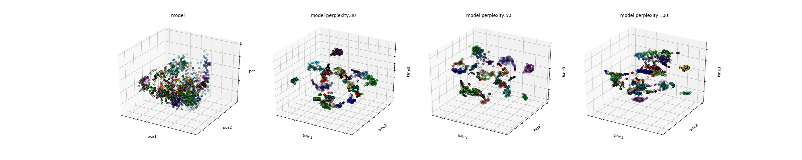

## RNA-seq latent featurizer using center loss cost function (CLRNA) v0.1
##### Authors: Stewart He (he6@llnl.gov), Jonathan E. Allen, Ya Ju Fan
##### Released: May 27th, 2021

### Description:
`CLRNA` is a python package built on Tensoflow to learn new features for RNASeq data.

Predictive modeling of patient tumor growth response to drug treatment is severely limited by a lack of experimental data for training.  Combining experimental data from several studies is an attractive approach, but presents two problems: batch effects and limited data for individual drugs and cell lines. Batch effects are caused by systematic procedural differences among studies, which causes systematic experimental outcome differences. Directly using these experimental results as features for machine learning commonly causes problems when training on one study and testing on another. This severely limits a model’s ability to perform well on new experiments. Even after combining studies, predicting outcomes on new patient tumors remains an open challenge.

We propose a semi-supervised, autoencoder-based, machine learning procedure, which learns a smaller set of gene expression features that are robust to batch effects using background information on a cell line or tissue’s tumor type. We implemented this reduced feature representation and show that the new feature space clusters strongly according to tumor type. This experiment is carried out across multiple studies: CCLE, CTRP, gCSI, GDSC, NCI60, and patient derived tumors. We hypothesize that using a batch effect resistant feature set across studies will improve prediction performance.

Genomic Data Commons (GDC) gene expression profiles for publicly available human tissues and cell lines from NCI60 and CCLE were processed using the semi-supervised learning procedure. Our autoencoder repurposes the ‘center loss’ (CL) cost function of [Wen et. al.](https://link.springer.com/chapter/10.1007/978-3-319-46478-7_31) to learn a more generalized set of features using the cell line or tissue’s tumor type. Classification is performed by branching network the ‘pinch’ layer of the autoencoder. The ‘pinch’ layer now gets fed into a classification layer as well as the decoder portion of the autoencoder.  

The new cost function balances the reconstruction performance, with the classification and ‘center loss’ performance. Reconstruction performance ensures that the ‘pinch’ layer retains information about original gene expression while classification performance shapes the space so tumors of the same type of close together regardless of the source study. Using the ‘pinch’ layer as new features reduces the number of features from 17,000 genes to approximately 1000 features or as few as 20 features.

The performance of this method is compared with traditional batch correction methods (e.g.  [ComBat](https://academic.oup.com/biostatistics/article/8/1/118/252073?login=true)).  Before applying these methods, individual samples clustered more strongly along study, a property that is not useful in many machine learning applications. We compare the new features from our ‘center loss’ autoencoder and ComBat using Silhouette score, the Calinski – Harabasz index, and the Davies – Bouldin index. All metrics show that using the prosed ‘center loss’ autoencoder features provide a latent space with better clusters than applying ComBat.

### Setup
To set up the Python environment needed to generate learning curves:
1. Install [conda](https://docs.conda.io/en/latest/) package manager.
2. Clone this repository.
3. Create the environment as shown below.

```bash
   conda env create -f environment.yml -n center_loss 
   conda activate center_loss 
```

### Data Download
Download data that is required to build a tabular dataset. The tabular dataset is then used to train the model that CLRNA can process.
1. Create an account on the Model and Data Clearinghouse ([MoDaC](https://modac.cancer.gov)). 
2. Run the script [./src/utils/download_data.py](./utils/download_data.py). This script downloads from MoDaC the following data: 
   * RNA-Seq expressions
   * cl_metadatia
3. When prompted by the training and test scripts, enter your MoDaC credentials.


#### Data Pre-Processing 
Preprocess the downloaded data into suitable format for CLRNA.
```
$cd ./src/ 
$ python preprocess_ftp_data.py 
num rnaseq samples 15196
num cell line labels 15196
num after merge 15196
number of classes with more than 100 examples: 31
number of classes with fewer than 100 examples: 37
dropped classes with fewer than 100 examples
14373
expecting around 12642
```

### Training the model  
To train the default model, run the following command:
```
$cd ./src
$ bash train.sh
...
2021-07-28 15:29
epoch 13
epoch 14
new best score 0.5080255
2021-07-28 15:31
epoch 15
epoch 16
new best score 0.47243702
2021-07-28 15:32
epoch 17
epoch 18
new best score 0.45152712
2021-07-28 15:34
epoch 19
Optimization Finished!
Done
```


### Download a trained model
To download a trained model instead of training a model, follow these steps:
1. Create an account on the Model and Data Clearinghouse ([MoDaC](https://modac.cancer.gov)). 
2. Run the script [./src/utils/download_model.py](./utils/download_model.py). 
3. When prompted by the training and test scripts, enter your MoDaC credentials.

### Encoding the samples 
To use trained model to encode the RNASeq samples, run the following:

```
$ cd ./src/ 
$ bash encode.sh
...
checkpoint is ../model/autoencoder_ratchet
restoring from previous run
dumping to  ../model/rnaseq_features_label.valid.y.encoded
dumping to  ../model/rnaseq_features_label.test.y.encoded
dumping to  ../model/rnaseq_features_label.train.y.encoded
Done
```

Encoded features will be saved to ```./model/```. It will have the same filename as the input except '.encoded' will be appended to the end of the filename e.g., ```rnaseq_features_label.test.y.encoded.npy```.

### Visualization of results 
The encoded features handle batch effect which can be seen by producing the plots as shown below:

```
> bash visualize.sh
explained variance
[0.2411185  0.2173541  0.11214621]
../data/processed_ftp_data/rnaseq_features_label.test.y.1
('#labels', (1438,), '#transformed', (1438, 3))
explained variance
[0.24758257 0.20721595 0.11479136]
../data/processed_ftp_data/rnaseq_features_label.train.y.1
('#labels', (2000,), '#transformed', (2000, 3))
explained variance
[0.24328862 0.21127205 0.11071263]
../data/processed_ftp_data/rnaseq_features_label.valid.y.1
('#labels', (1437,), '#transformed', (1437, 3))
Done
```
Example plots can be found in ```./figures/rnaseq_features_label.*.y.encoded.joined.png```

Here is an example of the encoded samples using Principal Component Analysis and 3D TSNE plots with three different [perplexity](https://scikit-learn.org/stable/auto_examples/manifold/plot_t_sne_perplexity.html) values.

 


### Glossary:
**output_folder:** Output directory. Model checkpoints will be saved here.

**summary_folder:** Usually the same as output_directory. 
    Model training summary will be saved here.
    
**train_X/valid_X:** Path to RNA seq features saved as a numpy file. One row
    per sample 17743 columns per sample. This file is generated in step 1 of the data section.
    
**train_y/valid_y:** Path to tumor features saved as a txt file. One row per
    sample. Each class should be represented as an integer. e.g 1, 2, 3. This file is generated in step 2 of the data section.

**encode_X/encode_y:** Files to be encoded. Follows the same format as
    training and validation files. Encode_y can be made up classifications.

### License
This is distributed under the terms of the MIT license.

All new contributions must be made under both the MIT licenses.

See LICENSE, COPYRIGHT, and NOTICE for details.

LLNL-CODE-824233
